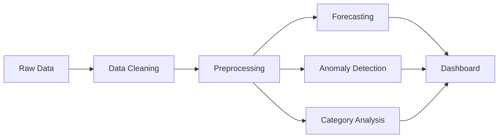

# AstraZeneca Cash Flow Analysis
## Datathon Presentation Structure

---

# Slide 1: Title Slide
**AstraZeneca APAC Cash Flow Intelligence**

- Team Name: [Your Team]
- Datathon 2024
- Date: December 2024

---

# Slide 2: Problem Statement

**Challenge:**
> Analyze APAC cash flow data to predict weekly net cash flow for 1-6 months and identify anomalies requiring business review.

**Key Deliverables:**
1. Weekly cash flow forecasting (1M & 6M)
2. Anomaly detection for irregularities
3. Category-based cash flow analysis

---

# Slide 3: Data Overview

**Dataset:** 84,528 transactions across 8 APAC entities

| Entity | Country | Transactions |
|--------|---------|--------------|
| TW10 | Taiwan | ~15K |
| PH10 | Philippines | ~12K |
| TH10 | Thailand | ~10K |
| MY10 | Malaysia | ~10K |
| ID10 | Indonesia | ~9K |
| VN20 | Vietnam | ~8K |
| KR10 | South Korea | ~7K |
| SS10 | Singapore | ~5K |

**Time Range:** 52 weeks of transaction data

---

# Slide 4: Methodology

**Techniques Used:**
- **Forecasting:** Holt-Winters Exponential Smoothing with damping
- **Anomaly Detection:** 2-Sigma statistical boundaries + rule-based flags
- **Data Pipeline:** Python (Pandas, NumPy, Plotly)

---

# Slide 5: Forecasting Solution

**1-Month Forecast (4 weeks):**
- Uses last 8 weeks of actual week-to-week changes
- Projects forward using historical patterns

**6-Month Forecast (24 weeks):**
- Damped trend (converges over time)
- Realistic variation using historical volatility (seeded for reproducibility)

**Dip Detection:**
- Threshold: <70% of historical average
- RCA: Top 3 category drivers shown on hover

*[Include screenshot of 1M/6M charts]*

---

# Slide 6: Anomaly Detection

**Types Detected:**

| Anomaly Type | Detection Logic | Priority |
|--------------|-----------------|----------|
| **Duplicates** | Same Amount + Date + Vendor | High |
| **Round Numbers** | ≥$100K exact multiples of $1K | Medium |
| **Volume Spikes** | Z-score > 2σ | High |

**Key Findings:**
- $X.XM in potential duplicate payments
- N transactions flagged as round number risk
- N volume spikes detected

*[Include screenshot of Anomaly chart with markers]*

---

# Slide 7: Category Analysis

**Cash Flow by Category:**

| Top Outflows | Top Inflows |
|--------------|-------------|
| Non Netting AP | Intercompany |
| Treasury | Loan Receipt |
| Operating | Other |

**Key Insight:** Operating activities dominate cash outflows

*[Include screenshot of Category horizontal bar chart]*

---

# Slide 8: Interactive Dashboard

**Command Center Features:**
- Real-time drill-down by entity
- Clickable action plan linking to charts
- Geo bubble map showing:
  - 🟢 Net Profit (positive cash flow)
  - 🔴 Net Deficit (negative cash flow)
  - 🟡 Duplicate Risk

*[Include screenshot of full dashboard]*

---

# Slide 9: Key Recommendations

**Executive Action Plan:**

| Issue | Action | Priority |
|-------|--------|----------|
| Duplicates: $X.XM | Audit vendor invoices | High |
| Round Numbers: $X.XM | Verify supporting docs | Medium |
| Week X Dip | Check [Category] trends | High |

**Strategic Metrics:**
- Operating Efficiency: 0.96x
- Weekly Burn Rate: $XXM
- Duplicate Recovery Potential: $X.XM

---

# Slide 10: Conclusion & Next Steps

**Achievements:**
✅ Built predictive forecasting for 1M & 6M horizons
✅ Implemented multi-layer anomaly detection
✅ Created interactive command center dashboard

**Future Enhancements:**
1. Entity-level forecasts visualization
2. FX impact analysis (currency volatility)
3. Automated alert system for forecast dips

**Thank You!**

---

## Notes for Presenters

- Replace [X.XM] with actual values from your run
- Include actual screenshots from the dashboard
- Customize team name and participant names
- Total: 10 slides as required
